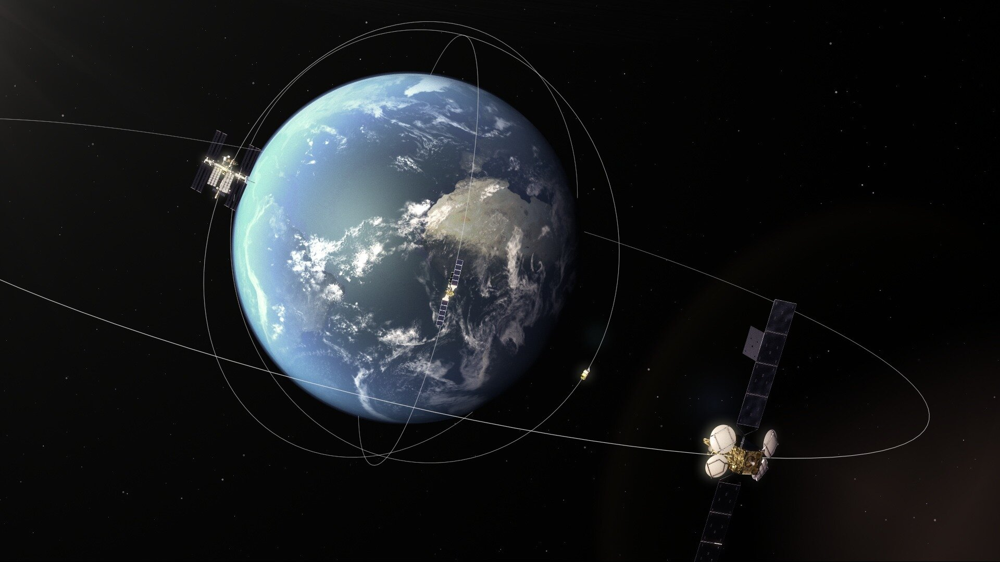

# orbi-france-3d
Simulation 3D du système solaire et des satellites français — Qt + Python + données CelesTrak

# 🌍 OrbiFrance 3D — Simulation spatiale Qt

**OrbiFrance 3D** est une application Qt qui simule le système solaire et affiche les satellites français en orbite autour de la Terre.  
Le projet combine **visualisation 3D (Qt Quick 3D)**, **calculs orbitaux (SGP4/Skyfield)** et **données réelles issues de CelesTrak et UCS Satellite Database**.

---

## 🚀 Fonctionnalités
- 🌞 Affichage 3D du système solaire (Soleil + planètes principales)
- 🛰️ Visualisation en temps réel des satellites français
- 🕐 Timeline pour naviguer dans le temps orbital
- 📄 Fiche d'information détaillée par satellite
- 🧭 Calcul d'orbite à partir de TLE (SGP4)
- ⚡ Architecture mixte : Qt C++ + Python (pour les calculs scientifiques)
